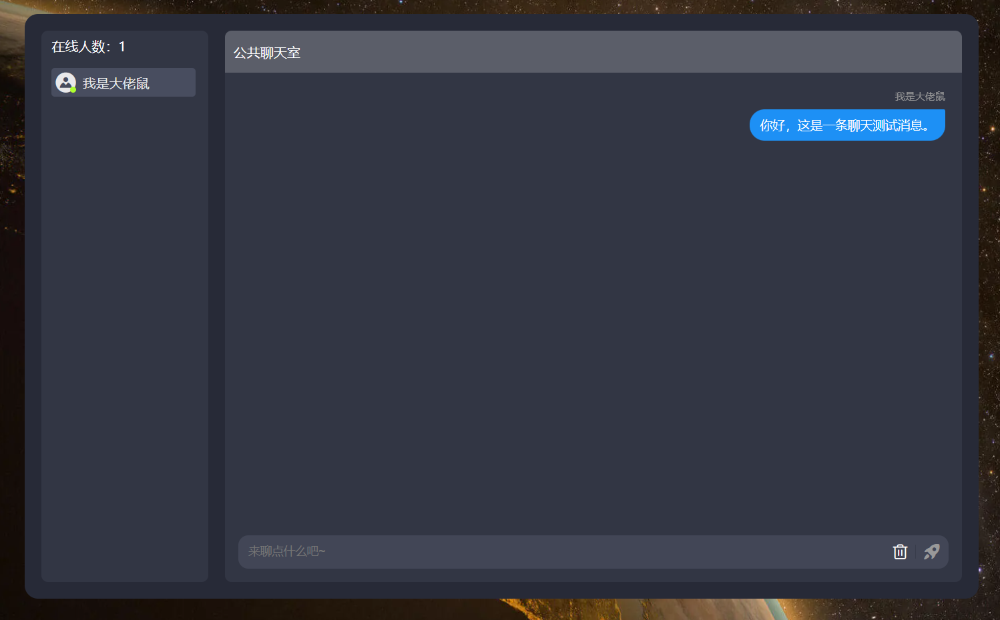

# P2P-Multiplayer-Chat-Room

This is an online multiplayer chat room implemented through P2P technology.

**快速体验**：[在线多人聊天室](https://dalaoshv.github.io/P2P-Multiplayer-Chat-Room/)

### 项目启动及部署

- 环境: node 18+， 包管理工具 pnpm (安装完 node 执行 `npm i pnpm -g` 即可);
- 依赖: git clone 工程到本地之后，执行 `pnpm i` 安装项目依赖
- 启动: 前端 `pnpm run start` 后端 `pnpm run server`

### 项目技术栈

#### 前端技术

|        技术        | 说明                                                        | 官网                                                             |
|:----------------:|-----------------------------------------------------------|----------------------------------------------------------------|
|       Vue3       | 前端流行开发框架                                                  | [https://cn.vuejs.org](https://cn.vuejs.org)                   |
|      Pinia       | vue3 官方推荐状态管理框架                                           | [https://pinia.vuejs.org](https://pinia.vuejs.org)             |
|    vue-router    | Vue 的官方路由                                                 | [https://router.vuejs.org](https://router.vuejs.org)           |
|    TypeScript    | 让 JS 具备类型声明                                               | https://www.typescriptlang.org/                                |
|   Element Plus   | 缓基于 vue3 的组件库                                             | [https://element-plus.gitee.io](https://element-plus.gitee.io) |
|       vite       | 极速的前端打包构建工具                                               | [https://cn.vitejs.dev](https://cn.vitejs.dev)                 |
|       pnpm       | 速度快、节省磁盘空间的软件包管理器                                         | [https://www.pnpm.cn](https://www.pnpm.cn)                     |
|      PeerJS      | PeerJS 将 WebRTC 作为 API 抽象、连接代理和二进制序列化，实现了真正的浏览器上的点对点数据通讯。 | [https://peerjs.com](https://peerjs.com)                       |
| Socket.IO-Client | 这是一个可以在客户端和服务器之间实现低延迟,双向和基于事件的通信的库。                       | [https://socket.io](https://socket.io)                         |

#### 后端技术

|      技术      | 说明                                                                | 官网                                                                                       |
|:------------:|-------------------------------------------------------------------|------------------------------------------------------------------------------------------|
| node-json-db | 一个基于NodeJs，使用JSON文件实现的简单开源数据库                                     | [https://www.npmjs.com/package/node-json-db](https://www.npmjs.com/package/node-json-db) |
| jsonwebtoken | JSON Web Token(JWT),又称为JSON令牌,是一种用于在网络应用之间安全地传输信息的开放标准(RFC 7519)。 | [https://jwt.io](https://jwt.io)                                                         |
|    NodeJS    | Node.js 是一个开源、跨平台的 JavaScript 运行时环境。                              | [https://nodejs.org](https://nodejs.org)                                                 |
|  Socket.IO   | 这是一个可以在客户端和服务器之间实现低延迟,双向和基于事件的通信的库。                               | [https://socket.io](https://socket.io)                                                   |

### 特别鸣谢

- [MallChatWeb](https://github.com/Evansy/MallChatWeb)